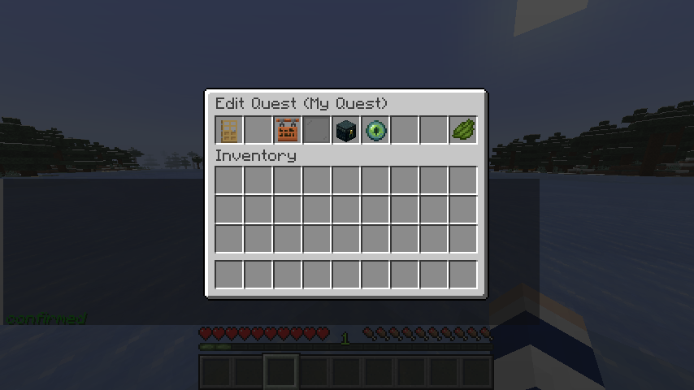
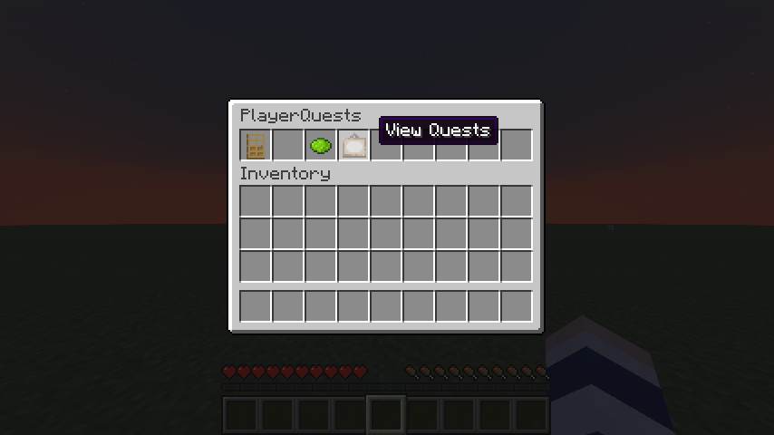
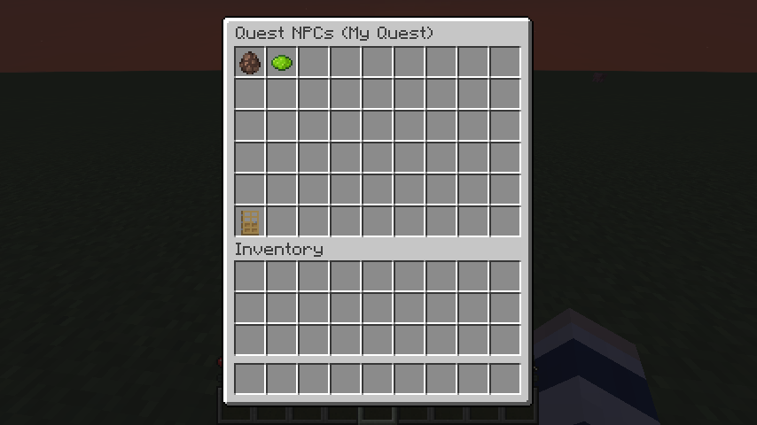
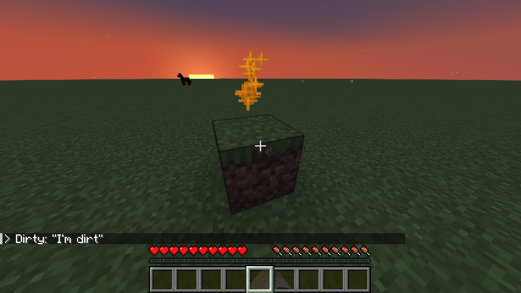
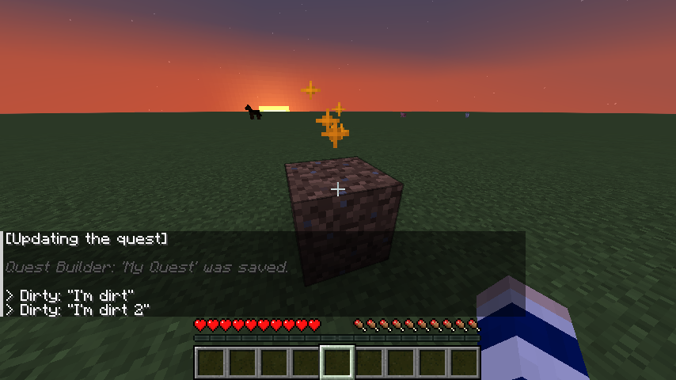

# 🏗️ PlayerQuests Tutorial
A text-based guide on how to create a very basic quest with PlayerQuests. It may seem complicated, but when you know the basics it's easy. 
This tutorial is structured to start at the most easy and common, to the most niche. You can stop at whatever point you are satisfied/come back another time.

###### ⚠️ If you close any of the menus without pressing **Save**, you’ll lose your progress!

 

### 1. Opening the menu
1. Type the command ``/playerquests``

 

### 2. Creating the quest
1. Click on the green **Create Quest** button
2. Type in your quest title (or type **'exit'** to leave). When you're happy type **'confirm'**
3. You’ll see a new screen that might seem a bit overwhelming... but don’t worry! Just press **Save** to create your quest. It won't have any NPCs or stages/actions yet, but that's okay! 😊

 

### 3. Editing a quest
Want to pick back up on working on your saved quest? Here’s how to do it!
1. Open the menu again and press **View Quests**

2. Find your quest title in the list and click on it 
    - If it's missing it probably means that it wasn't saved.
3. Press **Edit** to go back to the creation menu
4. Now we're back to the edit screen

 

### 4. Adding an NPC to your quest
Let’s make your quest even more exciting by adding an NPC! 🌈 Here’s how:
1. Go back to the quest editor
2. Press **Quest NPCs**
3. Press the green **Add NPC** button
4. There are lots of options here, but hang tight!
5. Let's customise this NPC
    1. Use the first option to **Set NPC Name**, like how we set the quest title
    2. Press **Assign NPC to...**
        1. Choose **A Block**
        2. Open your inventory and click a block, like a dirt block
        3. The block should show up on the right side as **Place NPC**, click this
        4. You can now place it somewhere to set the location the NPC will be
        5. You can also press it again to **Relocate NPC** it
        6. Press **Back**
    3. Press **Save**
        - If it doesn't let you, it should say why in the chat
6. Yay! An NPC has now been added
    - You can press the NPCs to edit it again
7. Go **Back** and press **Save**, your NPC block should now be in the world
    - You can't interact with NPCs like normal blocks, if your NPC for some reason is a door, you won't be able to open and close it.
    - If you destroy the NPC the quest will toggle off.

 

### 4. Making the NPC say something (Intro to quest actions & stages) 🌟
Big checkpoint! This is how we bring life to the quest.
1. Go back to your quest editor
2. Press **Quest Stages**
3. Press **stage_0**, which should be automatically created
    - To add a stage, press the green **Add Stage** button
    - The powered rail represents the ``entry point``, the first action that runs
4. Press **action_0**, which should also be automatically created
    - To add an action, press the green **Add Action** button
    - Automatically, every new action is 'None' which is an action that does nothing. Usually used to end a quest and stop all interactions.
5. Let's change the action! Press the firework to **Change Type**
6. Let's choose **Speak**
7. Now when we go **Back**, you can see more options on the right side
8. Let's set up the 'Speak' action, to make the NPC speak!
    - Press **Set NPC** and choose the NPC we created
    - Press **Set Dialogue** and type what the NPC should say
9. Done! Now just go **Back** a few times to get back to the main 'Edit Quest' screen
10. Press **Save**
11. Yay! Now the NPC should sparkle and right click should show your dialogue!

###### 🔔 A stage is just a big list of actions. Like a step in your quest. For example: a stage could be a conversation with the NPC with multiple 'Speak' actions.

 

### 4. Go from one action to the next action!
We have the NPC speaking, but only saying one thing. What if we want to add more things. How do we make them come one after the other?
1. Open your quest editor
2. Press **Quest Stages**
3. Go into one of your stages
4. Press the green button to **Add Action**
    - It'll create a detector rail icon (remember the powered rail is the entry action)
5. Click the new action that showed up
    - Here you could even make this action the entry point for the stage, but for the tutorial we will leave the current (action_0 as the) entry point
6. Make the NPC say something like in the last step (try to do from memory for practice!)
7. When you're done, go **Back**
8. Go to the other action, **action_0**
9. Press the sticky piston **Change Sequence**, this is a super power for sorting out the flow of your quest
10. One of these options is **Set Next Step**, this will set what action comes after this one! Super easy
11. Go into the **stage_0** category
12. For the tutorial we will press **action_1** as our next.
    - If you want to go to the entry point, no matter what it is, you can choose **Just Select This Stage** and it will always use the entry point action! 
13. Go back to the main edit menu and press **Save**
14. Now there are two Speak actions!

###### 🔔 Try making it loop by setting the 'Next Step' of 'action_1' as 'action_0' or 'Just Select This Stage' to loop back to the start

 

## 🌟 Let's make more quests together!
You have the basics now! You should be able to do just about anything this plugin offers now.

If you have any questions, feel free to ask in the [Discord server](https://discord.gg/EvWVSn9URf)!
