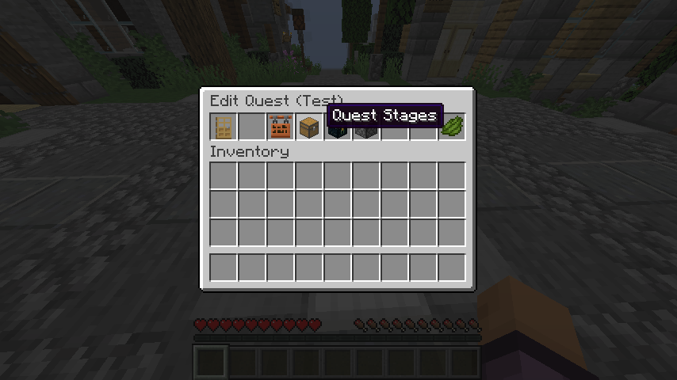
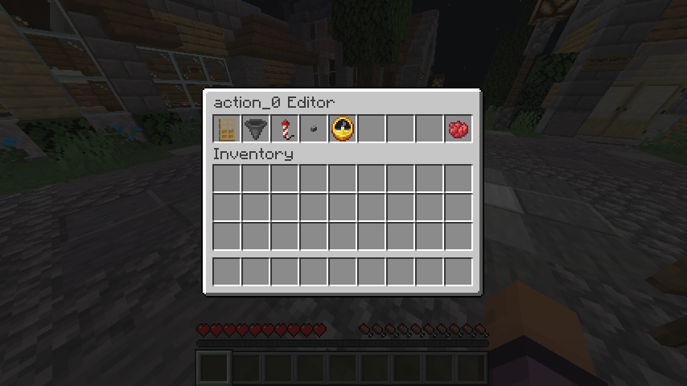

# 🏗️ PlayerQuests Tutorial
##### It may seem complicated, but when you know the basics it's easy. 
This tutorial is structured to start at the most easy and common, to the most niche. You can stop at whatever point you are satisfied/come back another time.

###### ⚠️ If you close any of the menus without pressing Save, you’ll lose your progress!
###### 🔃 Last Updated: 31/01/2025

 

## 1. Opening the menu
1. Type the command ``/playerquests`` into chat

 

## 2. Creating a quest
1. Click on the green **Create Quest** button

2. Send your quest title in the chat (or send **'exit'** to leave). I'll call mine **'Test'**. When you're happy send **'confirm'**
3. You'll see a new screen that might seem a bit overwhelming... but don't worry! Just press **Save** to create your quest. It won't have any NPCs, stages or actions yet, but that's okay! 😊

 

## 3. Editing a quest
> Want to pick back up on working on your saved quest? Here's how:
1. Open the menu again and press **'Edit Quests'**

2. Find your quest title in the list and click on it
    - If it's missing, it probably means that it wasn't saved
3. Press 'Edit' to go back to the quest editor for it

4. Now we're back to the edit screen!
    - Any edits saved to a quest will make all progress reset for people playing it

 

## 4. Adding an NPC to your quest
> Let’s make your quest even more exciting by adding an NPC! 🌈 Here’s how:
1. Go back to the quest editor
2. Press **'Quest NPCs'**

3. Press the green **'Add NPC'** button

4. There are lots of options here, but hang tight!
5. Let's customise this NPC
    1. Use the first option to **'Set NPC Name'**, like how we set the quest title (I'll call my NPC **'Wei'**)

    

    2. Press **'Assign NPC to...'**

        

        1. Choose **'A Block'**

        

        2. Open your inventory a click a block, like a dirt block
        3. The block should show on the right side as **'Place NPC'**, click this (it will only take it from you when you save)

        

        4. It will take all your blocks, you just place it somewhere to set the location the NPC will be
        5. You can also press it again to **'Relocate NPC'**
        6. Press **'Back'**
    3. Press **'Save'**
        - If it doesn't let you save, it should say why in the chat
6. Yay! An NPC has now been added for use in your future quest!
    - You can press the NPC egg to edit your NPC more/again
7. Go **'Back'** and press **'Save'**
    - Your NPC won't show in the world until it is told to be
    - You can't interact with NPC blocks like normal blocks, if your NPC is a door you won't be able to open and close it
    - If you destroy te NPC the quest will toggle off

 

## 5. Putting the NPC into the world (Intro to quest actions & stages) 
> Big checkpoint! Want to see the NPC as you play the quest? here's how:
1. Go back to your quest editor
2. Press **'Quest Stages'**

3. Press **'Add Stage'**, it will create **'stage_0'**

4. Press the new **'stage_0'** button, it will show a stage editor menu
    - Stages are used to organise a bunch of related actions
5. In the stage editor menu, press **'Add Action'**

6. Press the new **'action_0'** button, it will show an action editor menu
    - The hopper is for setting the actions that come after this one (will be talked about later)
    - The firework is for changing the action type
    - The clock is for setting conditions for the action to continue (will be talked about later)
    - The red dye is to delete the action

## 6. Making the NPC say something 🌟
> Bring your NPC to life, here's how:

## 7. Go from one action to the next action!
> Two dialogues in a row!? here's how:

## 8. Conditions for the action to continue, like a certain time of day!
> Specify requirements your action needs to continue, here's how: